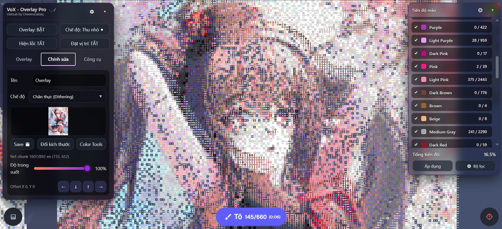

# VoX - Overlay Pro cho Wplace (Bản Việt hóa)

**Dựa trên code gốc của shinkonet, được chỉnh sửa và duy trì bởi @SrCratier.**
**Việt hóa & tùy biến bởi [CheemsGalaxy](https://github.com/CheemsGalaxy).**

Một userscript nâng cao dành cho `wplace.live`, cho phép tải, định vị và quản lý các bản overlay (template) chồng lên canvas của trang. Bản này được tối ưu để tăng hiệu năng, độ chính xác khi chuyển đổi màu, và tích hợp sẵn nhiều công cụ giúp việc vẽ tranh cộng đồng dễ dàng và thoải mái hơn.

---

## 1. Cài đặt

Bạn cần cài một trình quản lý userscript trên trình duyệt trước.

### Trình duyệt hỗ trợ

| Nền tảng | Trình duyệt khuyên dùng |
| :--- | :--- |
| **PC / Mac** | Chrome, Firefox, Brave, Edge, Opera GX |
| **Điện thoại (Android/iOS)** | **Microsoft Edge (khuyên dùng)**, Kiwi Browser |

### Các bước cài đặt
1. **Cài Tampermonkey** từ kho tiện ích mở rộng của trình duyệt:
   - [Tampermonkey cho Chrome/Brave/Edge](https://chrome.google.com/webstore/detail/tampermonkey/dhdgffkkebhmkfjojejmpbldmpobfkfo)
   - [Tampermonkey cho Firefox](https://addons.mozilla.org/vi/firefox/addon/tampermonkey/)
   > *Trên điện thoại dùng Edge: bạn có thể cài tiện ích trực tiếp từ menu "Tiện ích mở rộng" của trình duyệt.*

2. [**Bấm vào đây để cài script**](https://raw.githubusercontent.com/CheemsGalaxy/Wplace_VoX-Overlay-Pro-Vietsub/main/WplacePro-VoX.user.js).
3. Tampermonkey sẽ tự mở tab yêu cầu xác nhận. Bấm **Install** hoặc **Update**.

---

## 2. Hướng dẫn sử dụng

### A. Tạo và tải Overlay
1. Mở panel VoX trên Wplace, vào tab **Overlays**.
2. Bấm **+ Thêm**, tab **Editor** sẽ tự mở ra.
3. Chọn **chế độ xử lý màu** (xem mục bên dưới), hoặc dùng chế độ mặc định (khuyên dùng).
4. Tải ảnh lên: dán **link ảnh trực tiếp** rồi bấm "Tải", hoặc bấm vào khung viền chấm để chọn **ảnh từ máy**.

### B. Các chế độ xử lý màu
Khi tải ảnh lên, script sẽ tự chuyển đổi màu sang đúng bảng màu chính thức của Wplace. Bạn có thể chọn cách xử lý:
* **Tiêu chuẩn (khuyên dùng):** Thuật toán tìm màu gần nhất, không gây nhiễu hình. Phù hợp cho phần lớn thiết kế, logo, hình khối phẳng.
* **Nâng cao (Pixel Art):** Ánh xạ màu theo khoảng cách toán học (Euclidean) một cách chặt chẽ. Chính xác nhất cho Pixel Art có viền rõ nét.
* **Chân thực (Dithering):** Rải sai số màu ra các pixel lân cận để tạo hiệu ứng chuyển màu/gradient mượt hơn. Hợp với ảnh chụp hoặc ảnh phức tạp.

### C. Đặt vị trí (đặt mốc neo)
1. Sau khi tải ảnh, bấm nút **Đặt vị trí: TẮT** ở trên panel (sẽ chuyển thành **BẬT**).
2. Bấm vào canvas đúng vị trí pixel bạn muốn làm góc trên-trái (0,0) của ảnh.
3. Script sẽ tự động đặt ảnh vào vị trí đó. Bạn có thể tinh chỉnh thêm bằng các nút mũi tên ở mục "Offset X / Y" trong tab Editor.
   > *Lưu ý: chỉ đặt được vị trí khi bảng chọn màu của Wplace đang đóng.*

### D. Panel chính và các chế độ hiển thị
Các nút trên đầu panel điều khiển cách overlay hiển thị:
* **Overlay (BẬT/TẮT):** Hiện hoặc ẩn toàn bộ các overlay đã tải.
* **Chế độ:** Đổi kiểu hiển thị overlay:
    * *Thu nhỏ (khuyên dùng):* Hiện ảnh dạng các chấm nhỏ cách đều, vẫn nhìn được canvas gốc bên dưới.
    * *Phía sau / Phía trên:* Phủ ảnh đặc hoàn toàn, nằm phía sau hoặc phía trên các pixel trên bản đồ.
    * *Gốc:* Tạm ẩn overlay để xem bản đồ thật.
* **Hiện lỗi (BẬT/TẮT):** Tô sáng bằng màu tương phản những pixel trên bản đồ chưa khớp với thiết kế của bạn.

> **💡 Mẹo hiệu năng:** Nếu vừa đổi độ trong suốt, vị trí, hoặc áp filter mà chưa thấy cập nhật, chỉ cần di chuyển bản đồ một chút hoặc đặt thử 1 pixel để màn hình refresh lại.

---

## 3. Công cụ bổ sung

### Tab Công cụ (Tools)
* **Sao chép Canvas:** Tải xuống 1 vùng canvas hiện tại dưới dạng PNG, cắt gọn chính xác.
    1. Đặt **Điểm A** ở một góc.
    2. Đặt **Điểm B** ở góc đối diện.
    3. Bật "Xem trước khu vực" rồi bấm "Tải xuống".
* **Phân tích tiến độ (Color Analysis):** Mở panel nổi theo dõi tiến độ dự án theo thời gian thực.
    * Tính % tổng tiến độ hoàn thành overlay.
    * Hiện danh sách số pixel còn thiếu, sắp xếp theo màu.
    * Cho phép lọc để hiện/ẩn từng màu cụ thể — tiện khi làm việc nhóm theo khu vực hoặc theo tông màu.

### Tab Editor
* **Công cụ màu:** Chỉnh và thay thế màu trong overlay bằng màu khác trong bảng màu chính thức của Wplace trước khi vẽ.
* **Đổi kích thước:** Công cụ scale ảnh tích hợp sẵn, không cần dùng phần mềm ngoài.

---

## 4. Tính năng kỹ thuật

* **Xử lý bất đồng bộ (Web Workers):** Chuyển đổi ảnh phức tạp chạy ngầm, không làm treo trình duyệt khi tải ảnh.
* **Hỗ trợ độ phân giải cao:** Giới hạn kích thước overlay lên đến **3000x3000px**.
* **Quản lý nhiều Overlay độc lập:** Có thể giữ nhiều template cùng lúc, mỗi overlay lưu riêng vị trí, độ trong suốt và filter màu, không xung đột nhau.
* **Tối ưu bộ nhớ:** Giới hạn cache dữ liệu bản đồ, giảm đáng kể RAM tiêu thụ khi dùng phiên dài.
* **Nhận diện lỗi chính xác hơn:** Đã sửa logic nhận diện pixel tối màu/đen, giúp hiển thị lỗi rõ ràng ở mọi tông màu.

---

## 5. Hỗ trợ & Lời cảm ơn

Trong panel chính, bấm nút **Cài đặt (⚙️)** để:
* Đổi giao diện **Sáng** / **Tối**.
* Chỉnh độ trong suốt panel.

Dự án này mã nguồn mở (GPLv3), việc bảo trì và Việt hóa cũng tốn khá nhiều thời gian. Nếu script giúp ích cho bạn hoặc cộng đồng vẽ tranh của bạn, hãy cân nhắc ủng hộ tác giả gốc.

Thông tin donate (Binance/PayPal) và danh sách người đã ủng hộ nằm trong menu Cài đặt của script.

---

*Vietsub & tùy biến bởi [CheemsGalaxy](https://github.com/CheemsGalaxy) — dựa trên [Wplace_VoX-Overlay-Pro](https://github.com/SrCratier/Wplace_VoX-Overlay-Pro) của SrCratier.*
